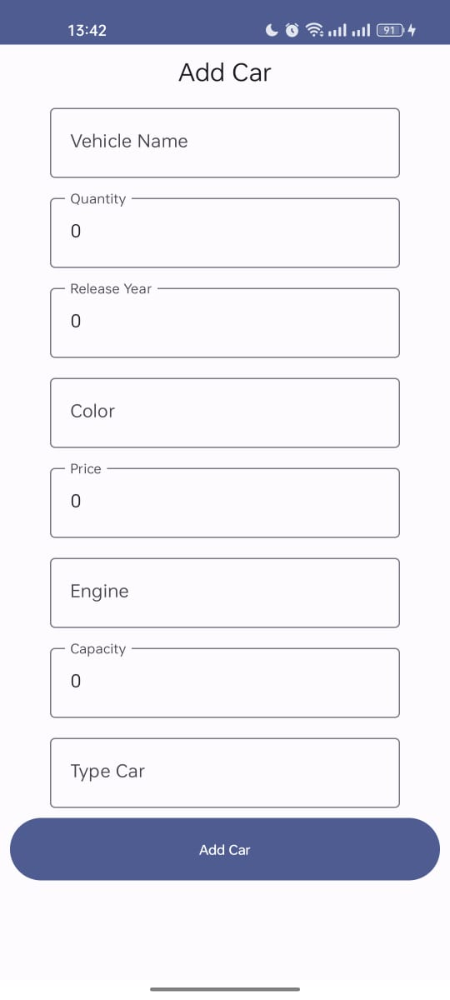

# PesaninApp

## Tech Stack

Kotlin
Room Database

## Feature

1. Melihat Stock Kendaraan
2. Penjualan Kendaraan
3. Laporan Penjualan per Kendaraan

How do I setup the Project

# Data Layer

1. Set Up Models (Car, Motorbike, and Selling)'

Make Vehicle Open class for Car and Motorbike

```kotlin
open class Vehicle(
    open val id: Int,
    open val vehicleName: String,
    open val releaseYear: Date,
    open val quantity: Int,
    open val color: String,
    open val price: Long
)
```

```kotlin
@Parcelize
@Entity(tableName = "car")
data class Car(
    @ColumnInfo(name = "car_id")
    @PrimaryKey(autoGenerate = true)
    override val id: Int,
    override val vehicleName: String,
    override val quantity: Int,
    override val releaseYear: Date,
    override val color: String,
    override val price: Long,
    val engine: String,
    val capacity: Int,
    val type: String
) : Vehicle(id, vehicleName, releaseYear, quantity, color, price), Parcelable
```

```kotlin
@Parcelize
@Entity(tableName = "motor")
data class Motorbike(
    @ColumnInfo(name = "motor_id")
    @PrimaryKey(autoGenerate = true)
    override val id: Int,
    override val vehicleName: String,
    override val quantity: Int,
    override val releaseYear: Date,
    override val color: String,
    override val price: Long,
    val engine: String,
    val suspensionType: String,
    val transmisionType: String
) : Vehicle(id, vehicleName, releaseYear, quantity, color, price), Parcelable
```

```kotlin
@Entity(tableName = "selling")
data class Selling(
    @ColumnInfo(name = "selling_id")
    @PrimaryKey val id: Int,
    val vehicleId: Int
)
```

2. Make Car Dao, Motor Dao, and Selling Dao

```kotlin 
@Dao
interface CarDao {
    @Insert(onConflict = OnConflictStrategy.REPLACE)
    suspend fun insertCar(car: Car)

    @Update
    suspend fun updateCar(car: Car)

    @Delete
    suspend fun deleteCar(car: Car)

    @Query("SELECT * FROM car")
    fun getAllCar(): Flow<List<Car>>

    @Query("SELECT * FROM car where car_id = :id")
    fun getCar(id: Int): Flow<Car>
}
```

```kotlin
@Dao
interface MotorDao {
    @Insert(onConflict = OnConflictStrategy.REPLACE)
    suspend fun insertMotor(motorbike: Motorbike)

    @Update
    suspend fun updateMotor(motorbike: Motorbike)

    @Delete
    suspend fun deleteMotor(motorbike: Motorbike)

    @Query("SELECT * FROM motor")
    fun getAllMotor(): Flow<List<Motorbike>>

    @Query("SELECT * FROM motor where motor_id = :id")
    fun getMotor(id: Int): Flow<Motorbike>
}
```

```kotlin
@Dao
interface SellingDao {

    @Insert
    fun addSellingData(item: Selling)

    @Update
    fun updateSellingData(item: Selling)

    @Query("SELECT id, vehicleId FROM car as C INNER JOIN  selling as S ON C.car_id = S.vehicleId")
    fun getAllSellingDatas(): Flow<List<Selling>>

    @Query("SELECT id, vehicleId FROM car as C INNER JOIN  selling as S ON C.car_id = S.vehicleId WHERE id = :id")
    fun getSellingData(id): Flow<Selling>
}
```

3. Make Database Connection

```kotlin
@Database(
    entities = [
        Car::class,
        Motorbike::class,
        Selling::class],
    version = 1
)
abstract class SellingVehicleDatabase() : RoomDatabase() {

    abstract fun carDao(): CarDao
    abstract fun motorDao(): MotorDao
    abstract fun sellingDao(): SellingDao

    companion object {
        @Volatile
        private var Instance: SellingVehicleDatabase? = null

        fun getDatabase(context: Context): SellingVehicleDatabase {
            return Instance ?: synchronized(SellingVehicleDatabase::class) {
                val instance = Room.databaseBuilder(
                    context,
                    SellingVehicleDatabase::class.java,
                    "selling_vehicle_db"
                )
                    .fallbackToDestructiveMigration()
                    .build()
                Instance = instance
                return instance
            }
        }

        fun destroyInstance() {
            Instance = null
        }
    }
}
```

I have an Issue found

```
java.lang.RuntimeException: Unable to start activity ComponentInfo{com.example.pesanin/com.example.pesanin.MainActivity}: java.lang.RuntimeException: Cannot find implementation for com.example.pesanin.data.SellingVehicleDatabase. SellingVehicleDatabase_Impl does not exist
```

And

```
Caused by: java.lang.RuntimeException: Cannot find implementation for com.example.pesanin.data.SellingVehicleDatabase. SellingVehicleDatabase_Impl does not exist
```

How I fix it

1. Add plugins ksp and newest version that compatible on build.gradle (project)

```
plugins {
    id("org.jetbrains.kotlin.android") version "1.9.20" apply false
    id("com.google.devtools.ksp") version "1.9.20-1.0.14" apply false
}
```

2. Add plugins and depedency ksp on build.gradle (App)

```
plugins {
    id("com.google.devtools.ksp")
}

dependencies {
    ksp ("androidx.room:room-compiler:$roomVersion")
}

```

3. Change compose and kotlin 1.9.20 Compatibility on gradle.build (app)

```kotlin
android {
    composeOptions {
        kotlinCompilerExtensionVersion = "1.5.4"
    }
}
```

3. Sync Project

# UI Layer

1. Make Screen that I needed
    - Main Screen (Car List)
    - Motor List Screen
    - Selling Screen
    - Add Car And Motor Screen

    - Navigation for Car List, Motor List, and Selling List

2. Connect Database to UI
```kotlin
        private val db = SellingVehicleDatabase.getDatabase(this)

        val repository by lazy {
            Repository(
                carDao = db.carDao(),
                motorDao = db.motorDao(),
                sellingDao = db.sellingDao()
            )
        }

        val homeViewModel = HomeViewModel(repository)

        setContent {
            PesanInTheme {
                // A surface container using the 'background' color from the theme
                App(homeViewModel)
            }
        }
```
3. Make Navigation Bottom Bar
```kotlin
@Composable
fun App( ) {
    val navController: NavHostController = rememberNavController()

    Scaffold(
        bottomBar = { BottomBar(navController = navController) }
    ) {
        BottomNavGraph(navController = navController,
        )
    }
}
```

4. Connect Screen in Navigation Component
```kotlin
@Composable
fun BottomNavGraph(navController: NavHostController, viewModel: HomeViewModel) {
    NavHost(
        navController = navController,
        startDestination = BottomNavScreen.Home.route
    ) {

        navigation(
            route = BottomNavScreen.Home.route,
            startDestination = BottomNavScreen.Home.CarList.route
        ) {
            composable(route = BottomNavScreen.Home.CarList.route) {
                HomeScreen(
                    modifier = Modifier,
                    viewModel,
                    onAddCarClick = {
                        navController.navigate(
                            NavScreen.CarAddScreen.route
                        )
                    },
                    onCarClick = {
                        navController.navigate(
                            NavScreen.CarDetail.createRoute(
                                carId = it.id.toInt()
                            )
                        )
                    }
                )
            }

            composable(route = NavScreen.CarDetail.route) {
                DetailScreen(id = id, viewModel = viewModel)
            }

            composable(route = NavScreen.CarAddScreen.route) {
                AddCarScreen(viewModel = viewModel, onAddButtonClick = {

                    navController.navigate(
                        BottomNavScreen.Selling.route
                    )

                })
            }
        }

        navigation(
            route = BottomNavScreen.Motor.route,
            startDestination = BottomNavScreen.Motor.MotorList.route
        ) {
            composable(
                route = NavScreen.MotorList.route
            ) {
                MotorListScreen()
            }

            composable(
                route = NavScreen.MotorAddScreen.route
            ) {
                AddMotorScreen()
            }
        }


        composable(
            route = BottomNavScreen.Selling.route
        ) {
            SellingScreen()
        }

        composable(route = BottomNavScreen.Profile.route) {
            ProfileScreen()
        }
    }
}
```

user Interface that i have done





